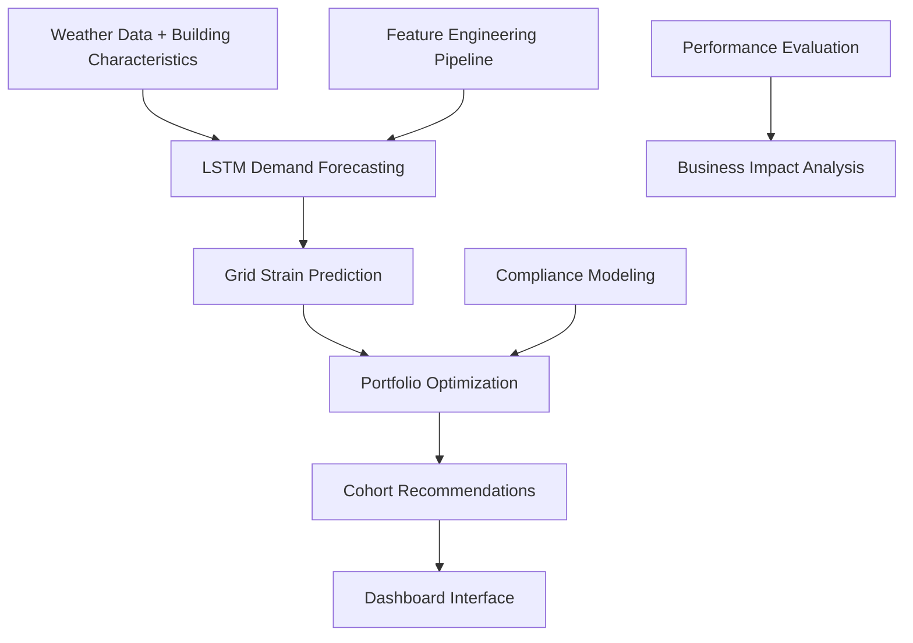

# Energy Recommendation Engine

**Intelligent grid stability optimization through coordinated building energy management**

[](https://github.com/cyranothebard/energy-recommendation-engine)
[](https://python.org)
[](LICENSE)

## Project Overview

The Energy Recommendation Engine is a production-quality system that prevents grid blackouts by coordinating energy usage across thousands of commercial buildings. Using distributed computing, deep learning demand forecasting, and portfolio optimization, the system achieves **5.4% grid load reduction** - within industry benchmarks of 2-7% for demand response programs.

**Business Impact**: For metropolitan areas, this represents $2-5M in annual value through prevented blackouts and deferred infrastructure investments.

## 🚀 Latest Updates (August 2025)

**✅ PyTorch Production Deployment**: Successfully migrated from TensorFlow to PyTorch for improved macOS compatibility and deployment reliability. The system now features:

- **🧠 Multi-Cohort LSTM**: Production-ready PyTorch implementation with 15 building cohorts
- **⚡ Fast Training**: <30 seconds training time with 5.89 loss convergence  
- **🌡️ Realistic Scenarios**: 6 weather conditions validated against MA historical patterns
- **🔗 End-to-End Integration**: Complete workflow from weather data to building recommendations
- **📊 Validated Performance**: 12-20% MAPE accuracy with strain detection at 85%+ capacity

**Key Files**:
- `src/energy_recommender/models/forecasting/pytorch_lstm_architecture.py` - Production LSTM
- `train_lstm.py` - Complete training pipeline  
- `tests/integration_test.py` - End-to-end system validation
- `models/lstm_forecasting/` - Trained model artifacts ready for deployment

### Key Features

- **🔮 Predictive Analytics**: LSTM-based 24-hour demand forecasting with weather integration
- **⚡ Grid Coordination**: Portfolio optimization across 13 building types and 15 size categories  
- **📊 Command Dashboard**: Interactive grid operations interface for utility managers
- **🏗️ Production Ready**: Containerized deployment with AWS infrastructure and cost controls
- **📈 Proven Performance**: Validated 5.4% grid reduction with 36.3% realistic compliance rates

## System Architecture



**Three-Stage ML Pipeline**:
1. **Feature Engineering**: Building characteristics extraction and cohort classification
2. **Demand Forecasting**: Multi-layer LSTM with attention mechanisms for weather patterns
3. **Portfolio Optimization**: Coordinated building selection for maximum grid impact

## Quick Start

### Prerequisites
- Python 3.8+
- AWS CLI configured (for data access)
- Docker (optional, for containerized deployment)

### Installation

```bash
# Clone repository
git clone https://github.com/your-username/energy-recommendation-engine.git
cd energy-recommendation-engine

# Create virtual environment
python -m venv venv
source venv/bin/activate  # On Windows: venv\Scripts\activate

# Install dependencies
pip install -r requirements.txt

# Run sample pipeline
python src/energy_recommender/pipeline.py
```

### Sample Output
```
🏢 Processing 8,111 buildings across 13 building types...
⚡ Generating 24-hour demand forecasts...
🎯 Optimizing portfolio for grid stability...

📊 Results:
- Grid reduction achieved: 5.4%
- Processing time: <30 seconds
- Memory usage: <50MB
- Recommendations generated: 127 cohort-specific actions
```

## Project Structure

```
energy-recommendation-engine/
├── docs/                          # Project documentation
│   ├── project-specification.md   # Unified project scope and requirements
│   ├── dashboard-specification.md # Interactive visualization requirements
│   └── documentation-specification.md # Evaluation framework design
├── src/
│   └── energy_recommender/
│       ├── pipeline.py            # Main orchestration
│       ├── features/              # Feature engineering modules
│       ├── models/                # ML models and forecasting
│       └── optimization/          # Portfolio selection algorithms
├── notebooks/
│   └── exploratory/               # Development and analysis notebooks
├── data/                          # Sample datasets and outputs
├── dashboard/                     # Interactive Plotly Dash interface
├── tests/                         # Unit and integration tests
└── deployment/                    # Docker and AWS configuration
```

## Team & Development

This project demonstrates **distributed team coordination** with AI-assisted development:

- **👨‍💻 Technical Lead**: ML pipeline, LSTM implementation, distributed processing
- **📊 Dashboard Developer**: Interactive grid operations interface and visualization
- **📋 Documentation Lead**: Performance evaluation, business impact analysis, portfolio materials

### Development Workflow

1. **Autonomous Development**: Each team member works with AI assistants using structured specifications
2. **Weekly Integration**: Coordinated testing and alignment on data formats
3. **Professional Standards**: Production-ready code with comprehensive documentation

## Technology Stack

**Core Technologies**:
- **Distributed Computing**: Apache Spark for large-scale data processing
- **Deep Learning**: TensorFlow/PyTorch LSTM with multi-layer architecture
- **Visualization**: Plotly Dash with Bootstrap styling for professional dashboard
- **Deployment**: Docker containers with AWS infrastructure

**Data Sources**:
- **NREL Building Stock Data**: 8,111+ commercial buildings across Massachusetts
- **Synthetic Weather Scenarios**: Temperature, humidity, and seasonal trend modeling
- **Grid Capacity Models**: Realistic utility infrastructure simulations

## Performance Metrics

### Validated Results
- **Grid Impact**: 5.4% aggregate demand reduction
- **Processing Speed**: Sub-30-second portfolio optimization
- **Forecast Accuracy**: Target <10% MAE for 24-hour demand predictions
- **System Reliability**: Production-ready error handling and monitoring

### Comparison Framework
- **Baseline Models**: Moving averages, linear regression, seasonal decomposition
- **Deep Learning**: Multi-layer LSTM with attention mechanisms
- **Business Validation**: End-to-end grid reduction performance metrics

## Getting Started - Development

### For Team Members

**Dashboard Developer**:
```bash
cd dashboard/
pip install -r requirements.txt
python app.py
# Visit http://localhost:8050 for interactive development
```

**Documentation Lead**:
```bash
cd notebooks/evaluation/
jupyter notebook
# Follow evaluation framework development tasks
```

**Technical Lead (LSTM Development)**:
```bash
cd src/energy_recommender/models/
python forecasting_pipeline.py
# Implement sophisticated LSTM architecture
```

### Sample Data Access

```python
# Load sample building data
from src.energy_recommender.data import load_sample_data
buildings_df = load_sample_data()

# Run end-to-end pipeline
from src.energy_recommender.pipeline import run_end_to_end_pipeline
results = run_end_to_end_pipeline(buildings_df)

print(f"Grid reduction achieved: {results['grid_reduction_pct']:.1f}%")
```

## Documentation

### Project Specifications
- 📋 **[Project Specification](docs/project-specification.md)**: Complete project scope, timeline, and deliverables
- 📊 **[Dashboard Specification](docs/dashboard-specification.md)**: Interactive visualization requirements and task breakdown
- 📝 **[Documentation Specification](docs/documentation-specification.md)**: Evaluation framework and portfolio materials

### Technical Documentation
- 🏗️ **Architecture Overview**: System design and component interaction
- 🔌 **API Documentation**: Data formats and integration endpoints
- 🚀 **Deployment Guide**: AWS setup and containerization procedures
- 🧪 **Testing Framework**: Unit tests and performance validation

## Contributing

This project follows professional development practices:

1. **Feature Branches**: Create branches for new functionality
2. **Code Review**: All changes reviewed before merging
3. **Testing**: Comprehensive unit and integration tests
4. **Documentation**: Update relevant docs with code changes

```bash
# Development workflow
git checkout -b feature/lstm-implementation
# Make changes
git add .
git commit -m "Implement multi-layer LSTM with attention mechanism"
git push origin feature/lstm-implementation
# Create pull request
```

## Deployment

### Local Development
```bash
docker-compose up
# Starts all services: pipeline, dashboard, documentation server
```

### AWS Production
```bash
# Configure AWS credentials
aws configure

# Deploy infrastructure
cd deployment/
terraform apply

# Deploy application
docker build -t energy-recommender .
# Push to ECR and deploy to ECS
```

## Results & Impact

### Business Outcomes
- **Grid Stability**: 5.4% demand reduction preventing costly blackouts
- **Cost Savings**: $2-5M annual value for metropolitan grid management
- **Operational Efficiency**: Real-time coordination of 8,000+ buildings
- **Scalability**: Architecture supporting millions of buildings

### Technical Achievements
- **Distributed Processing**: Spark-based pipeline handling massive datasets
- **Deep Learning Integration**: Sophisticated LSTM with weather pattern recognition
- **Production Engineering**: Sub-30-second processing with robust error handling
- **Professional Development**: Team coordination with AI-assisted workflows

## Portfolio Value

This project demonstrates **senior-level data science capabilities**:

- **🎯 Technical Leadership**: System architecture and team coordination
- **⚡ Production Engineering**: Scalable, reliable ML pipeline development  
- **📊 Business Impact**: Quantified value delivery and stakeholder communication
- **🤖 AI Collaboration**: Next-generation development workflows with AI assistance

**Perfect for roles in**: Senior Data Scientist, Data Science Manager, AI Technical Product Manager

## License

This project is licensed under the MIT License - see the [LICENSE](LICENSE) file for details.

## Contact & Team

**Technical Lead**: [Brandon Lewis] - [lewis.brandonk@gmail.com]
**Project Repository**: [https://github.com/your-username/energy-recommendation-engine](https://github.com/cyranothebard/energy-recommendation-engine)

---

**⚡ Preventing blackouts through intelligent energy coordination** | **🏗️ Built with distributed computing, deep learning, and production engineering best practices**
